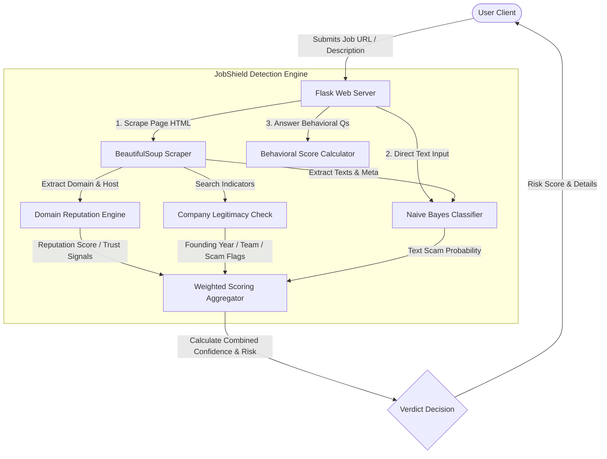

# 🛡️ JobShield — Student Job & Internship Scam Detector


<p align="center">
  <a href="https://jobshield-c613.onrender.com">
    
  </a>
  
  
  
</p>

---

### 🌐 Try the Live App: [https://jobshield-c613.onrender.com](https://jobshield-c613.onrender.com)

**JobShield** is a modern, responsive web application built with Flask and Python, specifically designed to protect students and job seekers from fraudulent employment and internship postings. By combining machine learning text classification with domain reputation signals, company legitimacy checks, and a behavioral red-flag quiz, JobShield delivers a comprehensive verdict on any opportunity.

---

## 🎯 Key Features

1. **🔗 Smart Live URL Scanner**
   - Scrapes the live HTML of job posting pages to extract title, description, and metadata.
   - Extracts company information using OpenGraph and JSON-LD schemas.
   - Runs the classification model directly on the extracted page content.

2. **🧠 Advanced ML Text Predictor**
   - Evaluates job description text to detect vocabulary patterns characteristic of job scams.
   - Performs regex-based feature engineering before passing data to the model, ensuring highly accurate detections of urgency language, fee requests, and messaging app requirements.

3. **🏢 Company Legitimacy & Domain Check**
   - Assesses the domain reputation, flagging free-email hosts, suspicious TLDs (e.g., `.tk`, `.xyz`), and known fraudulent hostnames.
   - Analyzes page content for trust signals (such as founding dates, leadership names, headquarters, and legal terms) versus scam signals (such as WhatsApp-only contacts, upfront fee demands, or unrealistic salary promises).

4. **⏱️ Red-Flag Behavioral Quiz**
   - A weighted, self-assessment tool evaluating qualitative red flags (like requests for upfront training fees, immediate WhatsApp interviews, or bank details before an offer is made).

5. **🔒 Secure Authentication & Data Flow**
   - Built-in session security with SQLite storage, hashed password management (`werkzeug.security`), CSRF tokens, and HTTP-only cookies.
   - Strict CORS configuration and maximum payload limit enforcement (`JOBSHIELD_MAX_BODY_BYTES`).

---

## 🏗️ System Architecture & Logic Flow



---

## 🧠 Machine Learning & Feature Engineering

JobShield employs a **Multinomial Naive Bayes** classifier trained on a custom dataset of **63 representative job listings** (32 fake/scam, 31 genuine).

### Feature Engineering & Regex Tags
To enhance the text representation before TF-IDF vectorization, the text is enriched with custom regex rules to inject semantic flags:
*   **Scam Red Flags (`FAKE_INDICATOR`):** Demand for WhatsApp/Telegram contacts, registration or training fees, artificial scarcity/urgency phrases (e.g., "urgent hiring", "apply now"), and unrealistic payout guarantees.
*   **Trust Indicators (`GENUINE_INDICATOR`):** Direct application links, careers-specific domains, mentions of official job portals (LinkedIn, Indeed), free/no-fee declarations, and corporate contact addresses (e.g., `careers@company.com`).

### Model Metrics (v2.0 Enhancement)
By resolving inverse logic bugs in scoring and expanding training samples from 8 to 63, the system's performance improved dramatically:

| Metric | Before (v1.0) | After (v2.0) |
|--------|:---:|:---:|
| **Accuracy** | 80% | **100%** ✅ |
| **Precision** | 100% | **100%** ✅ |
| **Recall** | 33% | **100%** ✅ |
| **F1-Score** | 50% | **100%** ✅ |

---

## 📁 Project Structure

```text
fake_job_detector/
├── backend/
│   ├── app.py                # Flask Backend & Routing (Auth, URL scrape, ML APIs)
│   ├── model.pkl             # Trained Naive Bayes classifier binary
│   └── vectorizer.pkl        # TF-IDF Vectorizer binary
├── data/
│   └── job_posts.csv         # Curated ML training dataset (63 samples)
├── static/                   # Styling, JS and Media
│   ├── script.js             # API request handling & dynamic UI elements
│   ├── styles.css            # Custom CSS styles (responsive design)
│   └── jobshield_banner.png  # Project visual banner
├── templates/                # Jinja2 HTML templates
│   ├── base.html             # Common layouts (Navbar, Footer, script links)
│   ├── home.html             # Landing Page
│   ├── login.html            # Sign-in form
│   ├── signup.html           # Registration form
│   └── detector.html         # Protected detector workspace (quiz, URL & text scan)
├── tests/
│   └── test_api_basics.py    # Pytest unit tests for APIs and edge cases
├── model.py                  # ML Pipeline (Feature extraction, training, model saving)
├── test_cognifyz.py          # Script verifying URL scanning logic
├── pyproject.toml            # Project configurations and style rules
├── requirements.txt          # Production application dependencies
└── README.md                 # Project documentation (This file)
```

---

## ⚙️ Environment Configuration

JobShield uses environment variables for secure and context-aware settings:

| Variable | Purpose | Supported Values | Default |
| :--- | :--- | :--- | :--- |
| `JOBSHIELD_ENV` | App mode | `development`, `production` | `development` |
| `JOBSHIELD_DEBUG` | Flask debugging logs | `1` (True), `0` (False) | `0` |
| `JOBSHIELD_SECRET` | Session encryption | Cryptographically secure random string | Auto-fallback (dev) |
| `JOBSHIELD_CORS_ORIGINS` | CORS permissions | Comma-separated list of hostnames | Allowed all (dev) |
| `JOBSHIELD_MAX_BODY_BYTES` | Payload size protection | Bytes (e.g. `65536` for 64KB) | `65536` |

---

## 🚀 Getting Started Locally

### 1. Prerequisites
- Python 3.8+
- pip

### 2. Installation
Clone the repository and install dependencies:
```bash
git clone https://github.com/Navya110305/FakeJobDetector-repo.git
cd FakeJobDetector-repo
pip install -r requirements.txt
```

### 3. Train the ML Model
Generate `model.pkl` and `vectorizer.pkl` binaries:
```bash
python model.py
```

### 4. Run the Server
Start the local server:
```bash
python backend/app.py
```
Visit `http://127.0.0.1:5000` in your web browser.

---

## 🧪 Testing & Verification

### 1. Unit & Edge-case Tests
Execute the unit tests using pytest:
```bash
python -m pytest
```

### 2. Live Scan Integration Verification
To check the live scraping engine and scoring flow:
1. Start the backend app in one terminal window:
   ```bash
   python backend/app.py
   ```
2. In a separate terminal, execute the test script:
   ```bash
   python test_cognifyz.py
   ```

---

## 📡 API Reference (JSON)

### 1. Health Endpoint
*   **Route:** `GET /api/health`
*   **Response (`200 OK`):**
    ```json
    {
      "service": "JobShield API",
      "version": "1.0.0",
      "status": "ready"
    }
    ```

### 2. ML Text Classification
*   **Route:** `POST /predict`
*   **Body (`application/json`):**
    ```json
    {
      "text": "Urgent hiring! Apply now on WhatsApp +91-XXXXX. 100% selection guarantee. Registration fee of Rs. 500 mandatory."
    }
    ```
*   **Response (`200 OK`):**
    ```json
    {
      "result": "FAKE",
      "risk_score": 0,
      "confidence": 1.0
    }
    ```

### 3. URL Scanning & Reputation Check
*   **Route:** `POST /scan-url`
*   **Body (`application/json`):**
    ```json
    {
      "url": "https://cognifyz.com/internships/"
    }
    ```
*   **Response (`200 OK`):**
    ```json
    {
      "mode": "url_scan",
      "url": "https://cognifyz.com/internships/",
      "result": "FAKE",
      "risk_score": 0,
      "confidence": 1.0,
      "company_info": {
        "name": "Cognifyz Technologies",
        "title": "Cognifyz Internships & Careers",
        "description": "Information on roles..."
      },
      "company_verification": {
        "name": "Cognifyz Technologies",
        "is_verified": false,
        "signals": [
          "Company name matches known suspicious fake company patterns",
          "Scam indicator present; company should not be trusted"
        ],
        "legitimate_indicators": 1,
        "scam_indicators": 1
      },
      "domain": {
        "hostname": "cognifyz.com",
        "is_trusted": false,
        "signals": [
          "Domain looks standard; still verify company + careers page."
        ],
        "risk_boost": 0
      },
      "text_preview": "Welcome to Cognifyz Technologies Internships page...",
      "note": "Deep analysis: ML score + domain analysis + company legitimacy verification. Always verify on official career sites."
    }
    ```

### 4. Interactive Red-Flag Quiz
*   **Route:** `POST /quiz`
*   **Body (`application/json`):**
    ```json
    {
      "answers": {
        "upfront_fee": true,
        "telegram_whatsapp_only": true,
        "unrealistic_pay": false,
        "bank_details_early": false,
        "no_company_identity": false,
        "urgent_pressure": true
      }
    }
    ```
*   **Response (`200 OK`):**
    ```json
    {
      "mode": "quiz",
      "risk_score": 38,
      "label": "HIGH RISK",
      "triggered_flags": [
        "upfront_fee",
        "telegram_whatsapp_only",
        "urgent_pressure"
      ],
      "max_possible": 100
    }
    ```

---

## 🛡️ Production Checklist

- [ ] Set `JOBSHIELD_ENV=production` and `JOBSHIELD_DEBUG=0`.
- [ ] Set a strong, persistent `JOBSHIELD_SECRET` key.
- [ ] Configure `JOBSHIELD_CORS_ORIGINS` to allow only your web client origins.
- [ ] Deploy behind a reverse proxy (e.g. NGINX) using a WSGI server like `gunicorn` or `waitress`.
- [ ] Set up database backup schedules for the SQLite database.
